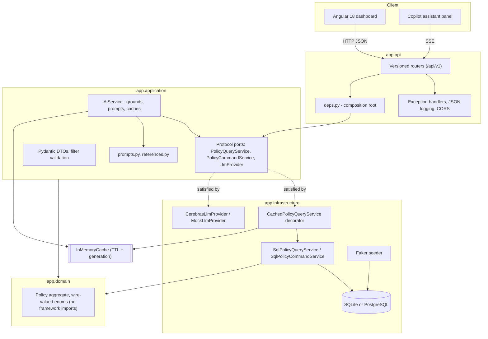

# Architecture & Trade-offs

## Layering

Dependencies point inward: `api → application → domain`, and `infrastructure →
application → domain`. `domain` and `application` never import SQLAlchemy or FastAPI.
The ports in `application/ports.py` are structural `Protocol`s, so the concrete
implementations never import them either — the arrow points one way only, and
`api/deps.py` is the single place that knows which class satisfies which port.

A `GET /api/v1/policies` request flows: router → `policy_filter_params` validates the
query string and raises once with *every* problem → `CachedPolicyQueryService` checks
the in-memory cache → on a miss, `SqlPolicyQueryService` composes one SQL statement
(filter → search → sort → page) → rows map to `PolicyDto`. Nothing above
`infrastructure` ever sees a `Session`.

## The AI path

`AiService` follows the same three steps for all three features:

1. **Ground** — read the live data the question is about, *through the same cached
   query service the REST endpoints use*, so the model and the dashboard can never
   disagree. Context is aggregates plus a bounded sample of rows, which keeps the prompt
   size constant as the book grows.
2. **Resolve references** — `references.py` extracts policy numbers, quoted terms and
   proper nouns from the question and looks those records up specifically. Without this,
   "why is PCL-100219 flagged?" would correctly but uselessly answer "the context does
   not contain that policy", because the statistical sample almost never includes the
   one row the user asked about. These lookups deliberately ignore the active filter:
   "that policy exists but is outside your current filter" is a more useful answer than
   "no record".
3. **Prompt, cache and call** — keyed on (task, model, prompt hash).

Provider selection is one function (`llm/factory.py`). `auto` uses Cerebras when a key
is present and the deterministic mock otherwise, so a fresh clone runs end to end
without credentials and the test suite never makes a network call.

## Caching

`InMemoryCache` is the Python counterpart of .NET's `IMemoryCache` plus a change-token
invalidator:

- per-entry TTL, checked lazily on read;
- a **generation** counter stamped on every entry, so one `invalidate_all()` after a
  mutation logically evicts everything without walking the dictionary;
- bounded size with FIFO eviction, so an unbounded stream of distinct filter
  combinations cannot grow the heap;
- hit/miss counters exposed at `GET /api/v1/cache/stats`, so the layer is observable
  rather than merely asserted.

Caching is applied by **composition, not branching**: `CachedPolicyQueryService`
satisfies the same protocol as the SQL implementation, so the API layer cannot tell them
apart and caching can be removed by editing one line in `deps.py`.

Invalidation is deliberately total rather than surgical. Flagging changes summary
aggregations and the contents of any list whose filter touches flagged state; computing
the precise affected key set costs more than rebuilding a handful of 30-second entries.
Because AI answers share the same cache, flagging a policy also invalidates answers that
were grounded in the pre-flag numbers.

## Key trade-offs

| Decision | Chose | Instead of | Why |
|---|---|---|---|
| Ports | `typing.Protocol` | ABCs | Structural typing keeps the dependency arrow one-way: implementations never import the port |
| Persistence | SQLAlchemy 2.0 async, SQLite by default | Postgres-only, or a plain in-memory list | Runs with zero setup, but the query pipeline is still real SQL; `DATABASE_URL` switches to Postgres unchanged |
| Schema | `create_all` at startup | Alembic migrations | One schema version with no upgrade path to honour; Alembic plus a migration job is the correct production answer |
| Money on the wire | JSON number via a serializer | pydantic's default | pydantic renders `Decimal` as a *string* in JSON, which would silently break every numeric format and sum in the UI. `Decimal` remains the in-process type |
| Validation | One `parse_policy_filter` that collects every error | FastAPI's per-field `Query(ge=…)` | FastAPI rejects on the first failing constraint; a caller should be able to fix a bad request in one round trip |
| Error shape | Hand-written `ErrorResponse` + 400 for validation | FastAPI's default 422 | Preserves the documented contract, so the Angular error interceptor needed no changes during the port |
| Markdown rendering | Small in-house parser rendering through Angular templates | `marked` + `DOMPurify` | Model output is untrusted text that can quote policyholder names; rendering through bindings means no HTML string exists for an injection to ride in on, and avoids a dependency for five constructs |
| Streaming transport | `fetch` + SSE | `HttpClient` / `EventSource` | `HttpClient` buffers the whole response, defeating streaming; `EventSource` cannot POST a JSON body |
| Frontend state | Angular signals | NgRx | Idiomatic at this complexity |
| Frontend UI | Semantic HTML + CSS custom-property tokens | Angular Material | Full control over theming and accessibility |
| Cache scope | Process-local, in-memory | Redis | An in-memory cache was the stated requirement; Redis is the swap for multi-replica |

## Known limitations

- **Single-node cache.** Process-local by design. With N replicas each holds its own
  copy and a mutation on one does not evict the others. Redis behind the same
  `InMemoryCache` interface is the fix.
- **No cache stampede protection.** Concurrent misses on the same key each run the
  query. For read-only queries that is wasted work, not incorrect work; single-flight
  coordination is the addition under real load.
- **Startup seeding and `create_all` run in-process.** Fine for a single-process POC;
  N replicas would race. A migration/seed job is the production pattern.
- **Leading-wildcard search.** `lower(col) LIKE '%term%'` runs on both SQLite and
  Postgres but cannot use an index. At POC volumes this is irrelevant; a `pg_trgm` GIN
  index (or a search service) is the documented follow-up.
- **Streaming answers bypass the prompt cache.** Deliberate — a cache hit would defeat
  the point of streaming. The non-streaming endpoint covers repeat questions.
- **No auth.** Out of scope for the POC; every endpoint is unauthenticated.

## Migration note

This backend replaces a .NET 8 Clean Architecture implementation, removed in the same
change. The layering, the caching semantics, the `/api/v1` surface and the
`ErrorResponse` shape were all carried across deliberately so the Angular client needed
no contract changes — only the additive AI endpoints are new. The frontend was moved
from Angular 21 to Angular 18 to meet the stated requirement; that required explicit
`standalone: true` on every component (default only from v19), `zone.js` back in the
polyfills, and Karma/Jasmine in place of the v20+ Vitest builder.

Tailwind 4 is retained with Angular 18 via an explicit `.postcssrc.json`. Angular 18's
builder declares an optional peer on Tailwind ≤3, which does not apply to how the build
actually works; `.npmrc` records `legacy-peer-deps=true` so a fresh `npm install`
succeeds.

## Verification

`backend/scripts/verify_api.py` hits every endpoint against a running stack, asserts
response shapes, and checks cache behaviour (repeat queries register hits; mutations
bump the generation and clear entries). Run it against `:5080` directly or against
`:4200` to exercise the same path the browser takes through the Angular proxy.

Last run: **57 passed, 0 failed** against live Cerebras (`gpt-oss-120b`), plus 55 passed
/ 2 skipped through the Angular proxy (`/health` and `/openapi.json` are not proxied —
the dev server forwards only `/api`).
