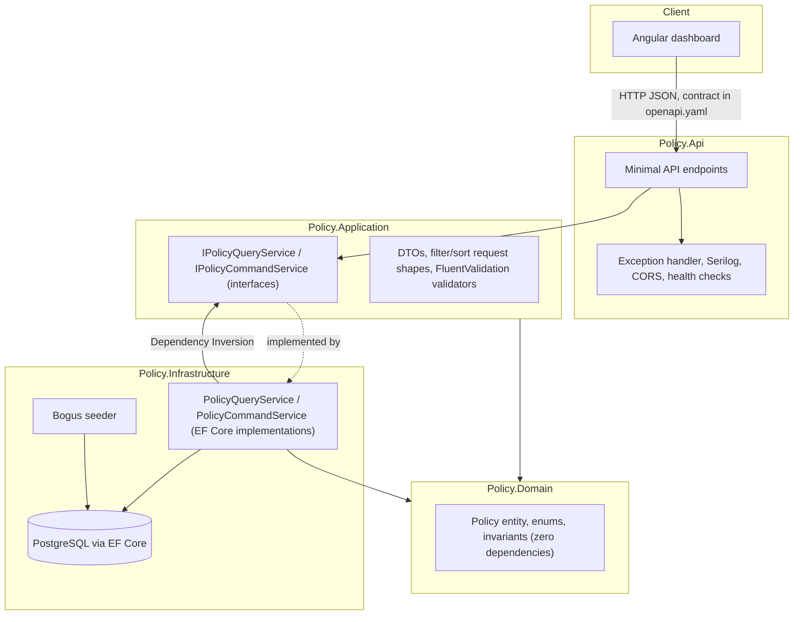

# Architecture & Trade-offs

## Layering



Dependencies point inward: `Api → Application → Domain`, and `Infrastructure →
Application → Domain`. `Domain` and `Application` never reference EF Core or ASP.NET
types — `Application` defines `IPolicyQueryService`/`IPolicyCommandService`, and
`Infrastructure` implements them against the real database. A request for
`GET /api/v1/policies` flows: endpoint → validates the query via a FluentValidation
validator registered by `Application` → calls `IPolicyQueryService` → the
`Infrastructure` implementation composes an `IQueryable<Policy>` (filter → search → sort
→ page) → EF Core translates that to one SQL query → results are mapped to `PolicyDto`
and returned. Nothing above `Infrastructure` ever sees a `DbContext`.

## Key trade-offs (full reasoning + dates in `AI_JOURNAL.md`)

| Decision | Chose | Instead of | Why |
|---|---|---|---|
| API style | Minimal API endpoints | MVC controllers | Faster for 4 endpoints, idiomatic .NET 8; either is defensible |
| Orchestration | Plain service interfaces | MediatR/CQRS pipeline | 4 endpoints don't justify mediator ceremony |
| Data access | `IApplicationDbContext`-shaped interfaces | Generic repository pattern | One aggregate; DI already gives Dependency Inversion |
| Mapping | Hand-written `ToDto()` extensions | AutoMapper/Mapster | ~4 DTOs; explicit is as fast and more debuggable |
| Contract tooling | Hand-written `openapi.yaml` + implementation kept in sync manually | NSwag/OpenAPI Generator server-stub codegen | No working `dotnet` toolchain available in this environment to safely run a generator (see below) |
| Backend test DB | Testcontainers.PostgreSQL | SQLite in-memory | Implementation uses Postgres-specific behavior (`ILIKE`, enum-as-string) SQLite doesn't emulate; Docker already required for the compose deliverable |
| Frontend state | Angular signals (`PolicyStateService`) | NgRx | Idiomatic at this complexity; NgRx is ceremony here |
| Frontend UI | Hand-rolled semantic HTML + CSS custom-property tokens | Angular Material | Full control over theming and accessibility without learning a library's surface under time pressure |
| Bulk flag | `ExecuteUpdateAsync` (one SQL UPDATE) | Load entities, mutate, `SaveChanges` | Single round trip, no N tracked entities |
| Summary aggregation | 3 targeted `GROUP BY`/`COUNT` queries | Per-status-value loop of separate `COUNT` calls | No N+1; each query is index-backed |

## What was deliberately left out (and why)

- **NSwag/OpenAPI-Generator server-stub codegen.** The spec asks for the contract to
  "drive server stubs and code generation." `openapi.yaml` was written first and the
  implementation matches it by hand, but no generator was run — see the environment note
  below.
- **Kafka event-driven flag-for-review events.** Would publish a `PolicyFlaggedForReview`
  event from `PolicyCommandService.FlagPoliciesAsync` after the `ExecuteUpdateAsync`
  succeeds, with a consumer handling it idempotently (keyed by policy id + a version/
  timestamp check). Not attempted — explicitly the assessment's own "advanced/optional"
  bonus.
- **`pg_trgm` GIN index for free-text search.** At 200+ seed rows a sequential scan
  under `ILIKE` is fine; a trigram index is the documented follow-up at real data volume.
- **Automated accessibility/e2e tooling** (axe-core CI gate, Cypress/Playwright). The
  manual semantic-HTML/ARIA work in every frontend component *is* in scope and done;
  automating the *verification* of it is the one accessibility item left as a follow-up.
- **Response caching** on `/summary`/list endpoints. Implemented via an in-memory
  `CachedPolicyQueryService` decorator (30s sliding TTL for lists, 60s for summaries)
  with generation-based invalidation — every mutation evicts the entire policy cache
  instantly via a `CancellationTokenSource` pattern. See `Infrastructure/Caching/`.

## Environment note — what was and wasn't verified

This repository was authored in an environment **without the .NET 8 SDK or Docker
installed** (confirmed absent from PATH). Practical consequences, stated plainly rather
than glossed over:

- **Backend**: all C# code, the `.sln`/`.csproj` files, and the initial EF Core
  migration were hand-written and have **not been compiled, run, or tested** here.
  `AI_JOURNAL.md` → "Tooling" has the detail; run `dotnet build` and `dotnet test`
  before trusting this compiles.
- **Frontend**: genuinely scaffolded, built, and tested with the real Angular CLI in
  this environment — `ng test` (17/17 passing) and `ng build --configuration
  production` both ran successfully here. Two real bugs (an npm arborist install
  failure, and a signal-ordering bug in `ThemeService`) were caught and fixed this way;
  see `AI_JOURNAL.md`.
- **Load test**: the command below is ready to run, but a p95 number could not be
  measured here since the backend can't run without the SDK/Docker.

```bash
docker compose up --build -d
npx autocannon -c 50 -d 20 -p 10 http://localhost:5080/api/v1/policies
npx autocannon -c 50 -d 20 -p 10 http://localhost:5080/api/v1/policies/<some-real-id>
```

Record the reported p95 here once run. The query pipeline is indexed specifically for
this (see `PolicyConfiguration.cs`): unique index on `PolicyNumber`; non-unique indexes
on `Status`, `LineOfBusiness`, `Region`; composite index on `(EffectiveDate,
ExpiryDate)`. `AsNoTracking()` is used on every read path and pagination/filtering/
sorting all happen in SQL, never in memory.
